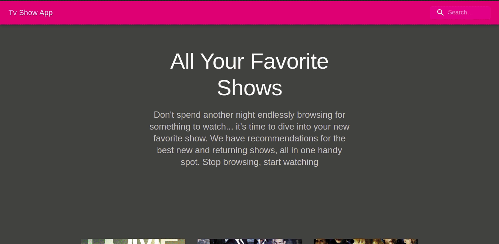

# Tv Show App

Simple TV Show app where you can search for shows

## Installation

Use the package manager npm to install Tv Show App.

In project directory run following commands:

```
1. npm install
2. npm run start
```

After what project should automatically open on : http://localhost:3000/

## Design


# Technical Notes

- Responsive design using Material UI Guidelines 🎨
- Environment set-up using Create-React-App ⚛️
- Dark Mode 🌑
- 'Enter' press key works on search field ⌨️

## Future development

- More features for shows
- Dark/Light mode Switch
- Including casts, trailers in episode component
